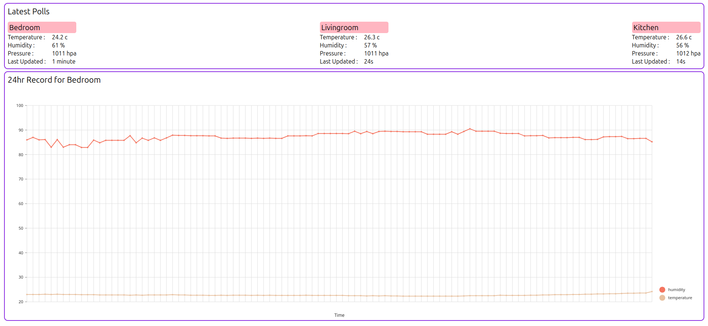

# Environmental Dashboard
A simple dashboard to read a restful api response from a local server

## Running
- `npm run dev` runs the development environment locally
- `npm run build` builds a deployable version

## Server Endpoints
`{serverpath}/get-sensors/`
### response structure
    [
      {
        "name": "Sensor Name", 
        "last updated": "2026-09-03 16:37:46", 
        "pings": [
          {
            "temperature": 24.1, 
            "humidity": 62, 
            "pressure": 1011, 
            "datetime": "2026-09-03 16:37:46"
          },
        ]
      }
    ]

## Example

